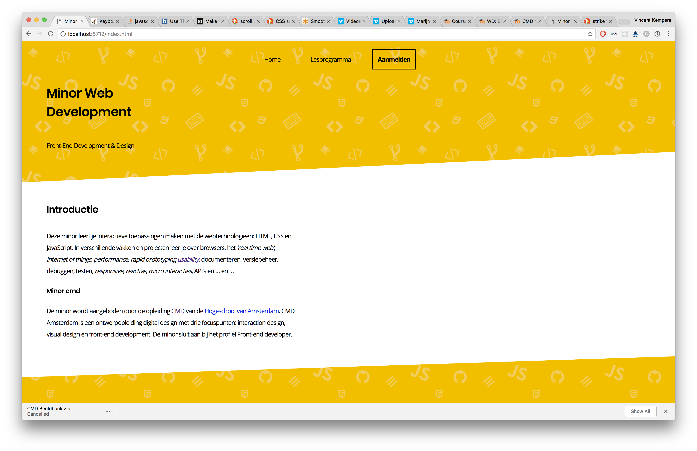
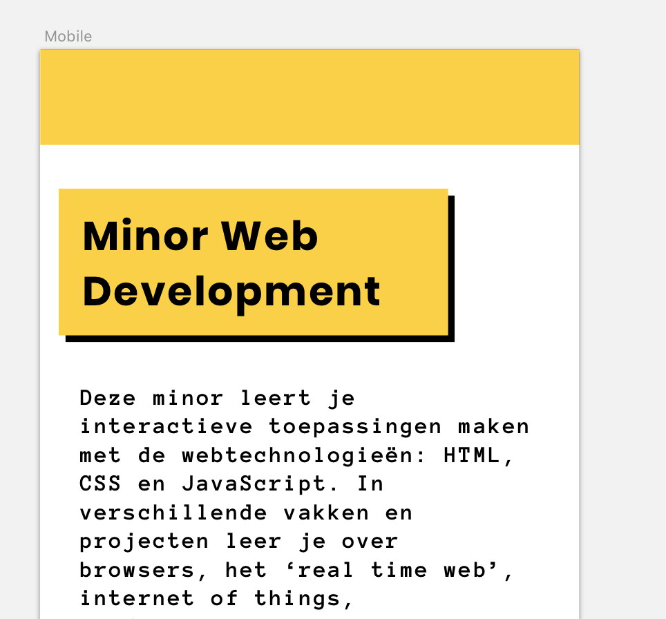
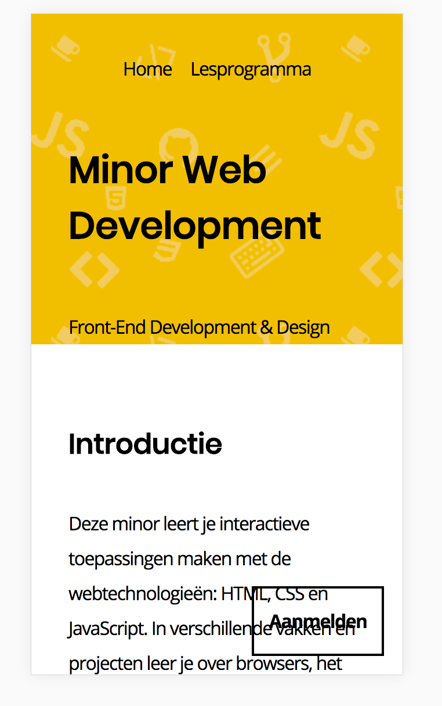
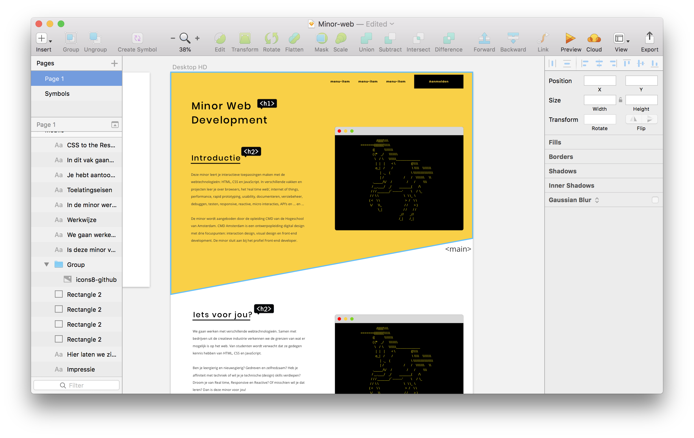
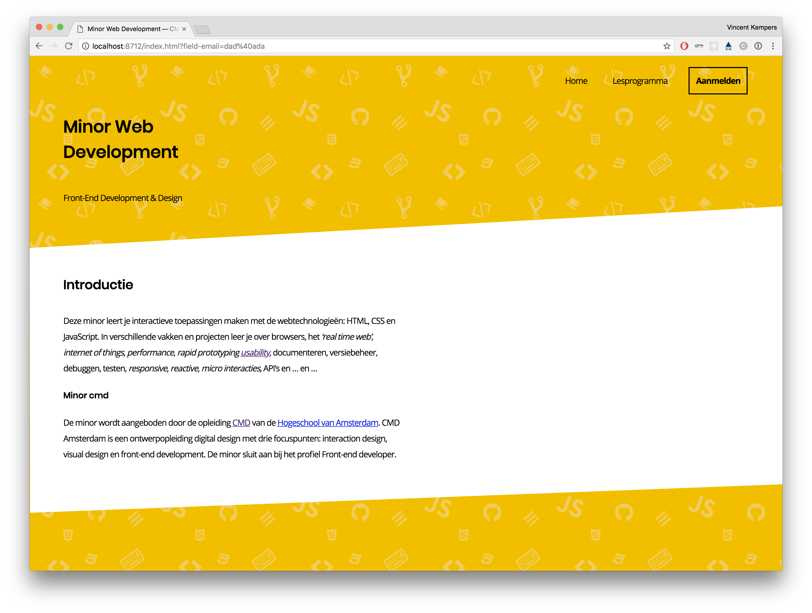
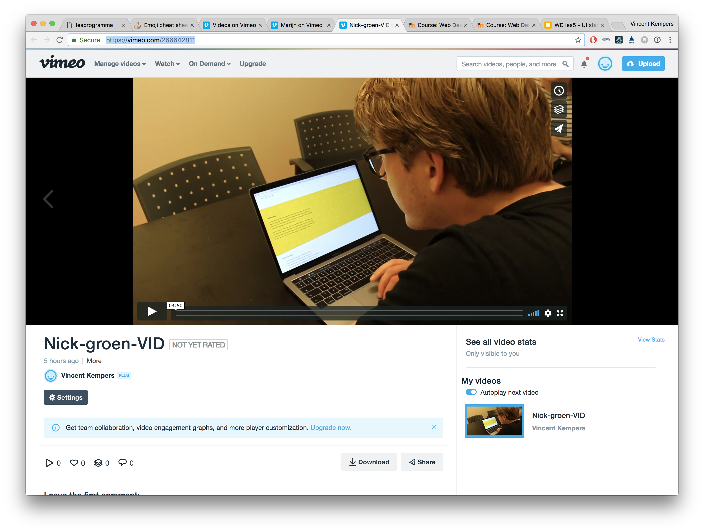
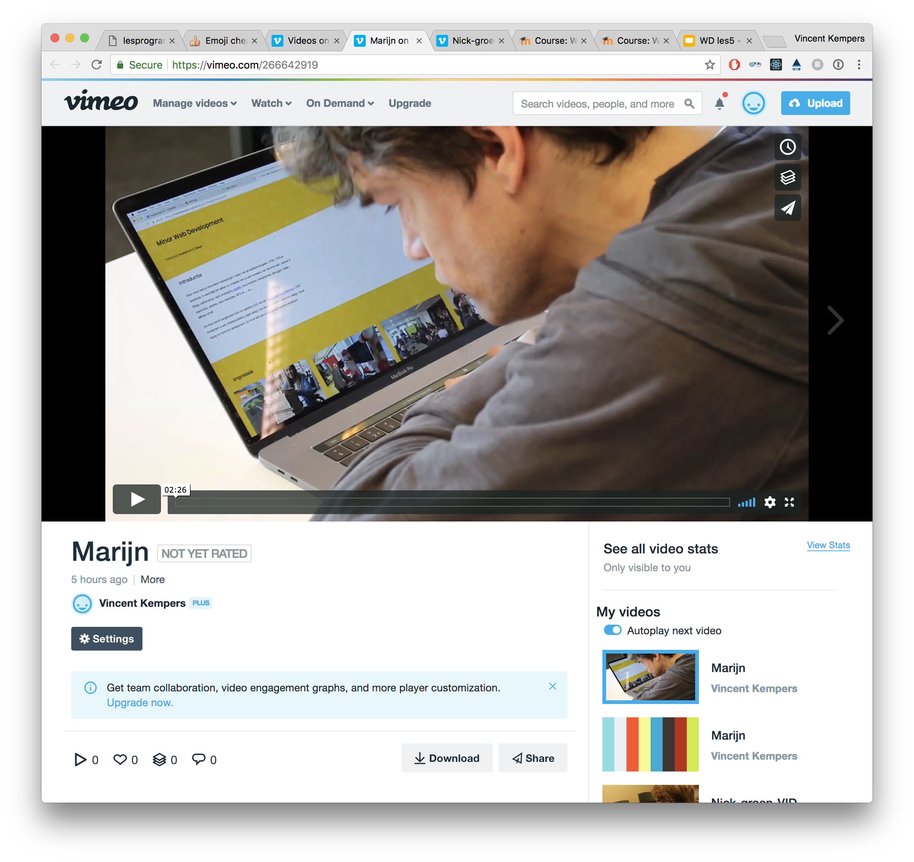

<h1 align="center">Minor Web-site.</h1>

  :iphone::computer: 

  <strong>Readme for the redesign of the minor web website</strong>

 

--------

## Minor website

The website of the minor web development needs an upgrade. It is my task to make this upgrade accessible for one user (Marijn) and for the users that would probably visit the site. That would be in this case students that need an minor in different cases. A user that would be looking for a minor that hasn't really been into development. And a user that knows that he wants.

I really want to challenge myself to please the new students and make it so pleasurable

## Approach

- [x] Inventory
- [x] User scenario's
- [x] Card sorting
- [x] Interview mens

## Re-arranged Inventory of the website

### What is this minor?

#### Application for the minor
**Home:** First thing you see should be the button. The button should access the information of "where can i join" and "how can i get my application.".

#### Introduction
**Home:** A short introduction about the minor web development. This is mostly focused on "web is cool" aspect but we want people to see more of our projects of what we made. So we really need to show more and tell less.

#### Programme
**Main:** A quick look of the programme and projects the minor is giving the students. This is currently being viewed on the page under details. The programme should be more _out_ there. Show the CSS hardships and the awesome things made with WAFS.

#### Is this minor for you?
**Main:** You want to set the tone for the minor and what kind of student the minor is looking for. This is mostly to "filter" the right students for the minor but also motivate the student who maybe isn't really secure about his choice.

#### Requirements
**Main:** I see requirements and is this minor for you as one thing!
Required to join the Minor.?
- HTML
- CSS
- Javascript

#### Impression
**Main:** A great way to show how great this minor is via pictures. The pictures that are being used now aren't really doing the "promotion" of the minor any good. Yes we have a great "vibe" going on but as a new student. I want to know what did you guys make and what did you learn. So I can see the more informative things.

#### Studentwork
**Main:** The studentwork of the minor this could be split up in years, but it should be on this website. It gains the "know" of what this minor is about and why it is the best minor out there.

#### Testimonials
**Footer:** What grades have been given to the minor. Plus a quote to finish it off.

#### Questions
**Footer:** You can ask away about the minor! To whom should be send **all** these awesome questions? Koop? :smirk:

## User scenario

### A Student that is looking for a minor

- [x] Needs to know who to contact for the minor.
- [x] Has a impression of the minor.
- [ ] Need to know what there was made.
- [x] Recommendations (_How did we score!?_).
- [x] Know where you can apply.

### User scenario
> Peter (22) is a student of CMD and really wants to be a developer. He is certain that he wants to do the minor, but needs to know when and where to sign up. He likes to know what he is going to learn from the minor web development.

> Nick (24) is a student of CMD and is into visual design, but has an affinity for web development. He is on the fence on which minor to choose. Nick had some positive experiences of other tech classes and would love to expand her knowledge. She really wants to make her designs come to life.

### Marijn

- [ ] ~~Has to navigate with tab~~ (_he uses space_).
- [x] Has a good knowledge of the minor.
- [ ] Need to know what there was made.
- [x] Recommendations (_How did we score!?_).
- [x] Know where you can subscribe.

> Marijn Meijles (?) is a developer with a great mind. His disability is makes it hard for him to make precise movements. So he navigate websites with his keyboard (_spacebar_). The navigation inside a website is mostly hard to do on the web. Marijn would love to know what the minor web development have made and what it's like to be in this minor. It should be a pleasurable experience.

## Design changes

These are the changes i made to the design.

Because of my user case is an actual person I could "spar" with him about what makes a good website for a minor. Not every conversation has been documented. But i made drastic changes in design style.

Changed design

  

  _I kept a close connection with my user the visual interface designer Nick Groen. He have seen this design and told me it was very boring. So i had to change this design because it was very boring._

  
   
  _On mobile you couldn't do diagonal lines (any good). So i kept de design on mobile simple but made use of patterns._

 

Changed desktop design

  
  _This wasn't the first "old" design this was probably 0.0.2 I started testing with diagonal lines and wanted it to be very "out there"._

  
  _With enhancing of the diagonal lines and the patterns it had a nice look to it. This is made it a little more nerdy and a bit more "our" style._

## Interface principle

:eyes:

## user tests

[Watch the Nick Groen user test video](https://vimeo.com/266642811)

### Nick
On content wise Nick wasn't really pleased. There was a lot of text and as a designer (as he put it) Less text more visual! Do more! Show more! I think i failed that on this part. The functional part of this design was focused on a fake terminal that didn't really work.

[Watch the Marijn user test video](https://vimeo.com/266642919)

### Marijn
##### Well, he didn't navigate with the tab...

So he uses the spacebar that functions as a "page down" I really couldn't fix the experience for him with the spacebar. What i could have done is probably let him navigate through every section via spacebar (an guided tour).
